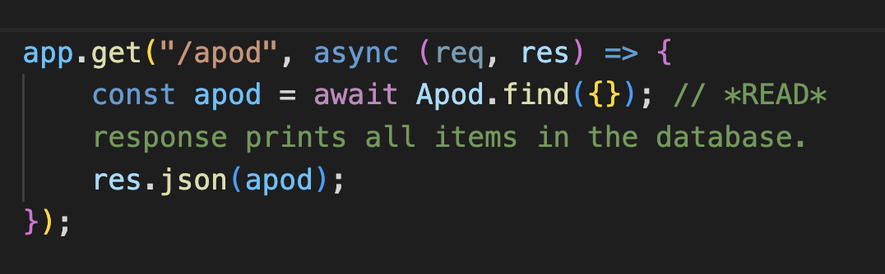
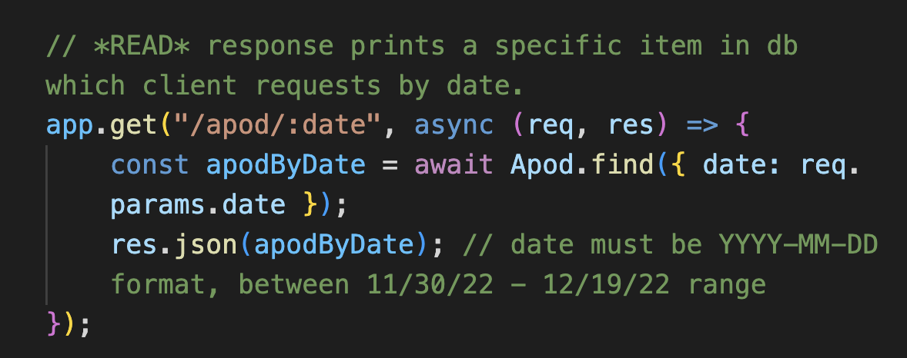
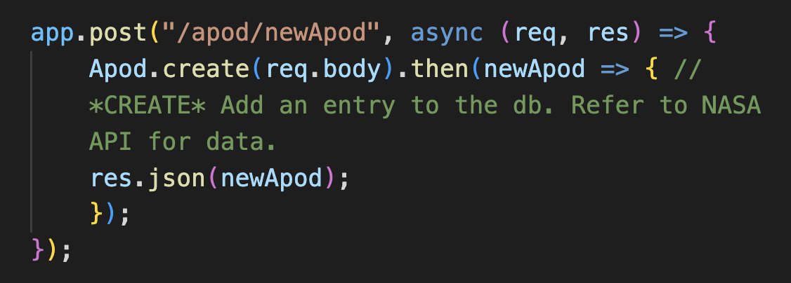
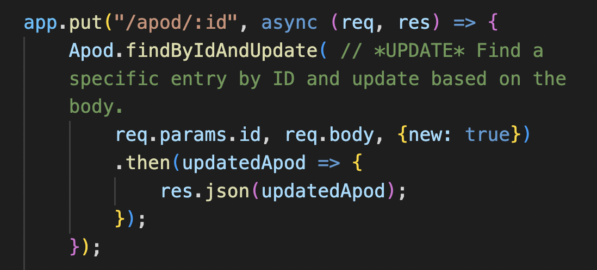
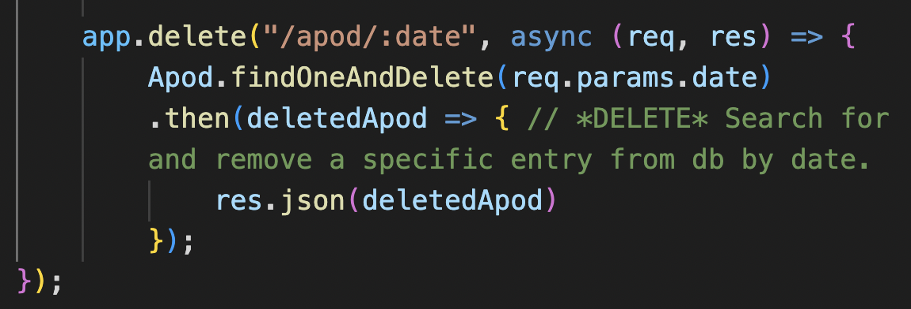

# Astronomy Photo of the Day API

## A simple API that offers help to cosmic explorers.

    This simple project archives images and information from NASA's Astronomy Photo of the Day into a separate API for easy navigation. With full CRUD functionality, users can read, add, edit, and delete information from pre-existing or newly created entries that stick to the familiar format of NASA's API. This NASA webpage is one of the most trafficked sites across all federal agencies and has been active everyday since 1995.

## Built With

    -JavaScript
    -Node
    -Node-Fetch
    -Mongoose
    -MongoDB
    -Express
    -FileSystem
    -NASA's publicly available [APOD API](https://apod.nasa.gov/apod/astropix.html)

## Features

    Read all entries

    

    Read one entry

    

    Create one entry

    

    Edit an entry

    

    Delete an entry

    

## Links

    
