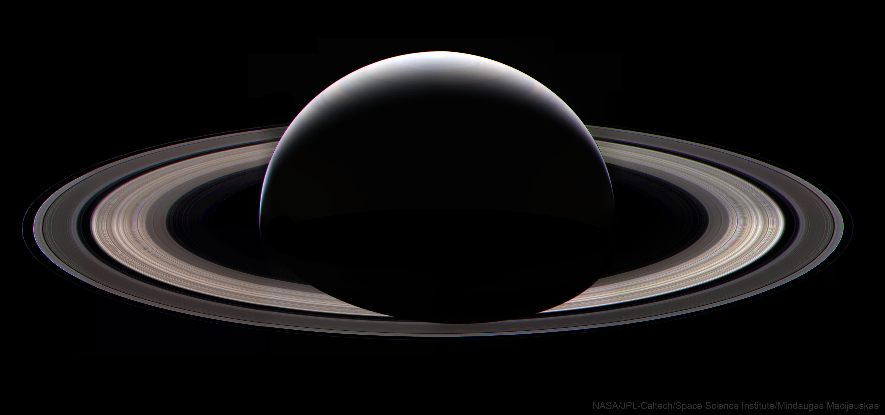

# Astronomy Photo of the Day API

## An API for the curious cosmic explorer

This simple project archives images and information from NASA's Astronomy Photo of the Day for easy navigation. With full CRUD functionality, users can read, add, edit, and delete information from pre-existing or newly created entries that stick to the familiar format of NASA's API. This NASA webpage is one of the most trafficked sites across all federal agencies and has been active everyday since 1995.

## Built With

- JavaScript
- Node
- Node-Fetch
- Mongoose
- MongoDB
- Express
- FileSystem
- NASA's publicly available [APOD API](https://apod.nasa.gov/apod/astropix.html)

## Features

Read all entries

Read an entry

Create an entry

Edit an entry

Delete an entry

## Installation instructions

To set up the app locally:

1. Fork and clone the [project repository](https://git.generalassemb.ly/rlanz1010/api-project)

2. Install all dependencies locally

    `npm i express mongoose node-fetch fs`

3. Ensure you have mongoDB installed

    `mongosh`

## Links

- [Project Repository](https://git.generalassemb.ly/rlanz1010/api-project)

- [NASA's List of API's](https://api.nasa.gov/) Scroll to find 'APOD', the API that seeded this project.

- [APOD Repository](https://github.com/nasa/apod-api)

## Future Improvements

This project could be expanded to include the entire NASA archive of daily astronomy images simply by altering the fetch URL to include the full date range. For demonstration purposes, I wanted to keep the seed data lean.

A keyword search function would also make this database far more useful to compare images and information from similar cosmic objects.

